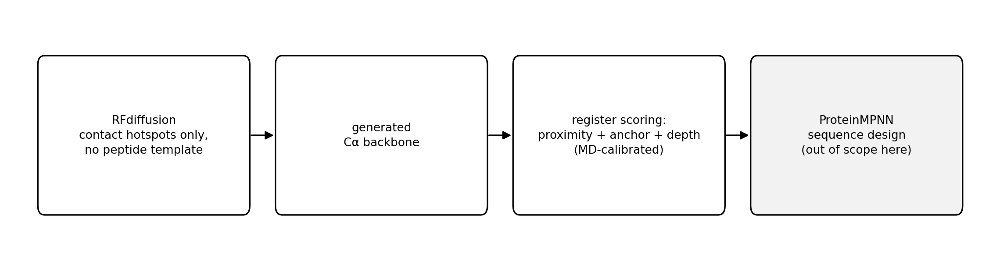
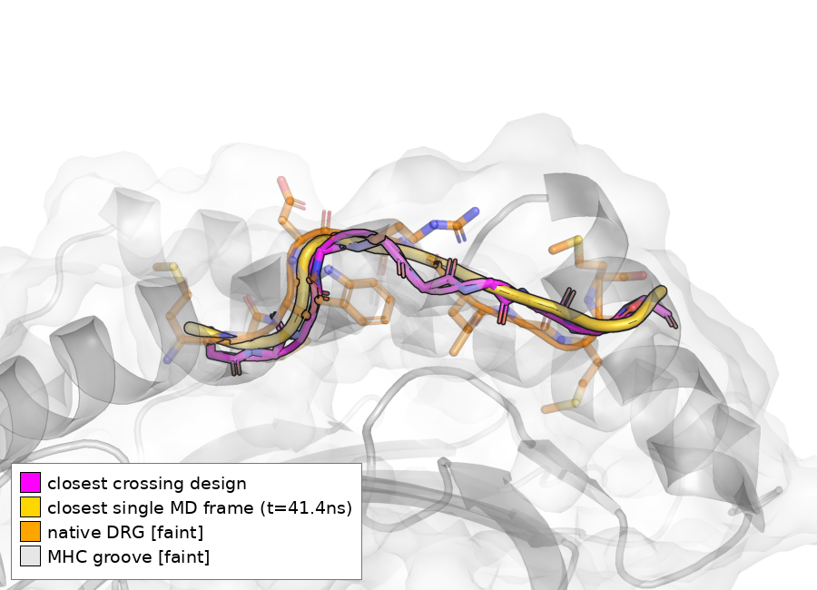
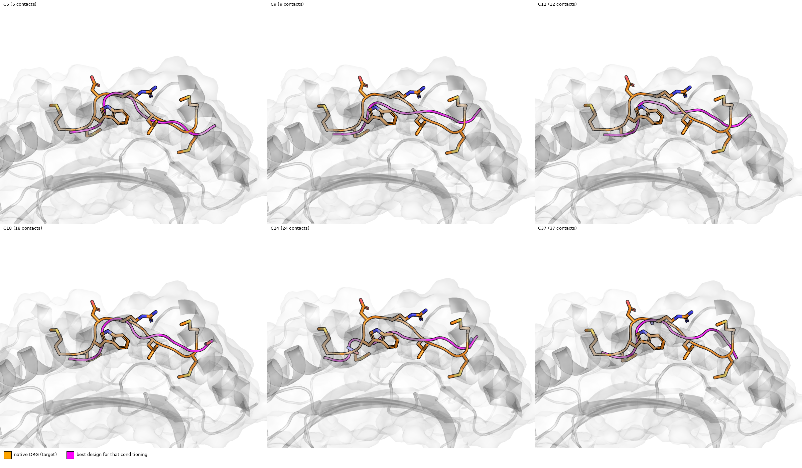
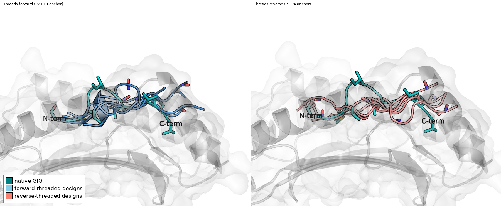

# Recovering and Redirecting Peptide Backbone Conformation via Contact-Conditioned Cα Generation in a Cross-Reactive pMHC–TCR System

*System: HLA-A\*02:01 in complex with TCR DMF5, cross-reactively engaging two distinct decameric peptides
— GIG (full sequence SMLGIGIVPV, PDB 6AM5) and DRG (full sequence MMWDRGLGMM, PDB 6AMU) — each bound in its
own crystallographically resolved backbone conformation. These are not the same peptide sequence in two
registers of a shared groove position; they are two different decamers that the same TCR/MHC pair
accommodates via two different peptide Cα conformations. We borrow the term "register" from that
structural-biology usage only to name each conformational state, and every claim below is about the Cα
trace of the bound backbone, never about sequence. Scope statement: RFdiffusion's raw output is
sequence-free (placeholder residues carry no side-chain atoms), and every scoring step described in
Methods operates on Cα coordinates. No sequence-identity, side-chain, or rotamer-level claim is made or
implied anywhere below.*

---

## Abstract

**Background.** GIG and DRG are two distinct decameric peptides, cross-reactively recognized by the same
TCR bound to the same class-I MHC groove, whose native backbones differ by 2.87 Å Cα RMSD while the MHC
groove and TCR CDR loops remain rigid (component-wise Cα RMSD 0.20–0.59 Å). This is a minimal system for
asking whether a structure-conditioned generative model can be steered, from receptor-side information
alone, toward a specific target backbone conformation.

**Question.** Can RFdiffusion, conditioned only on receptor-side contact residues (no peptide-backbone
template), generate a Cα backbone that (i) recovers a peptide's own native conformation or (ii) lands in
the alternate one?

**Approach.** We generated 1,295 de novo peptide backbones across 55 (crystal × conditioning) cells
spanning 3–42 contact hotspots and scored each against a three-criterion test — Cα proximity to the target
conformation's thermal mean, correct F-pocket anchor identity, and correct burial depth — calibrated
against a native 370 K/50 ns molecular-dynamics (MD) ensemble for each conformation. We quantified a
peptide-direction (N→C threading) artifact intrinsic to unconstrained backbone generation, tested whether
conditioning composition or sampling depth better explains the observed hit distribution, and launched a
dedicated null/background campaign (zero hotspots, zero template) to measure the chance rate directly.

**Results.** 5 of 1,295 designs (0.39%, 95% CI 0.13–0.90%) satisfy all three acceptance criteria: 1
"recovery" (own conformation) and 4 "crossings" (alternate conformation). All 5 were restricted to
conditioning cells covering ≥9 high-contact-degree receptor residues (5/718 vs. 0/587 under sparser
conditioning, Fisher's exact p=0.068, suggestive but not significant); cell identity within that richer tier
did not predict outcome (an equal-draw control across 8 conditionings converged to the same 2.06–2.55 Å
band regardless of composition; hit count across all 55 cells correlated with draw count, Pearson r=0.657,
p<0.0001, more than with any cell-specific property; the one cell with an elevated raw rate did not survive
Bonferroni correction, p=0.023→1.0). Roughly half of all generated backbones (repeatable across every
conditioning tested) bury the wrong terminus in the anchor pocket — a mirror-threaded artifact requiring
anchor-identity-based filtering rather than raw RMSD. A motif-templating control shows that directly
supplying backbone geometry (8/10 residues templated → 0.39 Å, sub-thermal precision) controls the target
conformation far more tightly than contact conditioning ever achieves (up to 42 contacts → ~2–2.5 Å floor;
Spearman ρ≈0.17, not significant). A dedicated zero-hotspot, zero-template null-baseline campaign, still
collecting toward its full target at the time of this writing, shows 0/28 designs so far satisfying any
acceptance criterion, with mean proximity an order of magnitude outside the acceptance band (§3.6).

**Conclusion.** Recovery and redirection of peptide backbone conformation are demonstrable, rare events
whose occurrence is gated by conditioning breadth (coverage of high-contact-degree residues) and whose
*frequency*, once that gate is met, is explained by sampling depth rather than by which specific
conditioning is used. Direct geometric templating remains a mechanistically distinct and far more precise
lever than contact conditioning alone.

---

**Figure 1 — Pipeline schematic.** RFdiffusion (contact-hotspot conditioning, contig `10-10`, no
peptide template) → generated Cα backbone → three-criterion register scoring against MD-calibrated
thresholds → (downstream, out of scope here) ProteinMPNN sequence design.

## 1. Introduction

Cross-reactive TCR–pMHC pairs that engage chemically distinct peptides via distinct bound backbone
conformations pose a design question orthogonal to conventional epitope design: can a structure-generative
model be conditioned, using only information available on the receptor side, to produce a specific target
backbone conformation — including, deliberately, the conformation other than the one nearest to the
conditioning input? We address this question exclusively at the Cα backbone level. RFdiffusion generates
backbone coordinates without an associated sequence at this stage of the pipeline; consequently every
metric defined here operates on Cα geometry, treated throughout as a geometric rather than sequence
property. GIG and DRG are not the same peptide sequence adopting two registers of a shared groove
placement — they are two different decamers (SMLGIGIVPV and MMWDRGLGMM) that DMF5 happens to recognize via
two different bound backbone shapes. We use "register" only as shorthand for "which of the two backbone
conformations," never to imply a shared sequence.

A central methodological problem in evaluating this kind of claim is that "resembles the native peptide"
has historically been operationalized as Cα RMSD to a single crystal structure, an unscaled quantity: a
design at 1.2 Å cannot be judged "inside" or "outside" a conformational envelope without knowing how wide
that envelope is. We address this by calibrating acceptance thresholds against a native 370 K/50 ns MD
ensemble of both conformations (Methods §2.4), and by requiring three independent criteria to agree
(proximity, anchor identity, burial depth) rather than relying on proximity alone, which is separately
confounded by a backbone-threading artifact (§3.4) that a raw-RMSD-only criterion cannot detect.

We report five results, ordered to lead with the central empirical finding (recovery and crossing both
occur and are quantifiable) before addressing what gates their occurrence, what does not explain their
rate, a methodological artifact that must be corrected for, and the underlying mechanism.

## 2. Methods

### 2.1 Structural system and conformational-state definition

The system is HLA-A\*02:01 (α1/α2/α3, chain A) with β2-microglobulin (chain B), a 10-residue peptide (chain
C), and the DMF5 TCR α/β V-domains (chains D/E), crystallized in two forms: 6AM5, bearing the peptide
SMLGIGIVPV ("GIG"), and 6AMU, bearing the peptide MMWDRGLGMM ("DRG") — two different decamer sequences, not
one sequence in two groove registers. Component-wise Cα RMSD between the two crystals (computed after
superposing the rigid MHC α1/α2 platform) localizes essentially the entire 2.87 Å difference between the
two complexes to the peptide backbone; the MHC groove floor (0.20–0.39 Å), CDR3α (0.59 Å), and CDR3β (0.47
Å) are rigid between the two forms. "Register" is used only as a name for a peptide's bound Cα
conformation in a common reference frame (§2.3); it carries no sequence-identity meaning here.

### 2.2 Backbone generation

De novo peptide backbones were generated with RFdiffusion (`Complex_base_ckpt.pt`, SE3nv environment),
contig specification `A1-180/0 B1-100/0 D1-115/0 E1-120/0 10-10` (MHC/B2M/TCRα/TCRβ held fixed as
structural context; the terminal `10-10` block is fully de novo with no peptide-backbone residues
templated), `diffuser.T=30` (full reverse-diffusion trajectory) throughout. Conditioning was varied solely
via `ppi.hotspot_res`, ranging from 3 to 42 receptor-side residues across 55 (crystal × conditioning) cells
drawn from 5 campaigns (internal names: `grind`, `ladder`, `promising`, `denovo30`, `maxcond`), totaling
1,295 scoreable 10-residue designs after filtering (§2.3). We name each conditioning cell by its hotspot
count (e.g. `C18` = 18 receptor-side hotspot residues) rather than by internal campaign codename, since
contact count is the property under discussion throughout §3; where the same count was tested on both
crystals we disambiguate with a crystal suffix, e.g. `C24 (6AM5)` vs. `C24 (6AMU)`. This is the corpus used
for the register test in §3.1–3.4; it is distinct from (i) the motif-templating ladder (§3.5), a separate
small set of cells (`fixall`→`fix0`, `rfd_recover` campaign, N=10 designs/crystal/level) that still carry
the full rich hotspot list but vary how much of the native peptide backbone is additionally supplied as a
template, and (ii) the null-baseline campaign (§3.6), a new set of cells (`null0`) carrying *no* hotspots
and no template at all. Of the 55 conditioning cells, 16 pool draws from more than one campaign launched at
different times under the same (crystal, conditioning) specification — e.g., the `C3`–`C12` contact-count
ladder draws from `denovo30`, `ladder`, and `promising` jointly, and `mhc`/`mhc_tcr2`/`tcr2` draw from
`denovo30` and `grind` jointly. We disclose this because it means the 55 cells are not 55 single-shot,
mutually independent draws; they are 55 conditioning *specifications*, several of which were incrementally
added to across sequential campaign launches. This is consistent with — and does not undermine — the §3.3
finding that per-cell hit count tracks cumulative draw count, since draws accumulated for the same cell
over time are exactly the repeated-sampling process that finding describes.

### 2.3 Register scoring

For each design, the MHC α1/α2 Cα trace is superposed onto a common reference frame via robust
(outlier-trimmed) Kabsch alignment; the peptide Cα coordinates are transformed into that same frame,
making them directly comparable to the two native reference conformations (GIG, DRG; each a fixed (10,3)
Cα array in the same frame) and to a native MD trajectory processed identically.

A design is scored on three criteria, each thresholded against a native MD ensemble of the *target*
conformation (own conformation for "recovery," alternate conformation for "crossing"):

1. **Proximity** — mean Cα RMSD to the target's 10-residue reference ≤ (native MD mean + 3σ) for that
   conformation.
2. **Anchor identity** — the design's Cα position with minimum distance to a fixed F-pocket centroid
   (defined from six HLA-A\*02 F-pocket residues) must equal the target's native anchor position (P10 for
   GIG, P9 for DRG).
3. **Burial depth** — that minimum F-pocket distance must fall within (native MD mean ± 3σ) for the target
   conformation.

All three must hold simultaneously. This retires two previously used but unreliable proxies: raw
RMSD-only thresholding (which never registers a crossing under any threshold in the 1.4–2.5 Å range tested
historically, a false-negative failure mode) and F-pocket-argmin proximity alone without a depth
requirement — 388/1,295 designs (30%) satisfy this alone, which we consider false-positive-prone, since it
is spoofable by centroid-adjacent scatter unrelated to genuine anchor burial.

**Threading classification.** Each design's F-pocket-proximal anchor position was additionally classified
as *forward* (positions P7–P10 occupy the F-pocket, matching both native conformations' actual anchor
placement) or *reverse* (P1–P4), with P5–P6 as an ambiguous buffer zone; this classification was derived
from the empirical bimodal distribution of anchor position across the full corpus (§3.4) and is applied as
a filter before all recovery/crossing statistics reported in §3.1–3.3 (forward-threaded subset, N=600).

### 2.4 Native MD calibration

Explicit-solvent MD (Amber ff19SB force field, TIP3P water, 12 Å periodic box, 0.15 M NaCl, 2 fs timestep,
minimization to convergence, ≤10,000 steps) was run for each crystal structure at 370 K (2 ns
equilibration, 50 ns production; Tamarind job identifiers `lbv69` for 6AM5 and `p1yv2` for 6AMU). A
convergence diagnostic found both trajectories still drifting over the production run (net +0.25 Å for
6AM5, +0.82 Å for 6AMU) with autocorrelation times of 5.3 ns (6AM5) and 10.7 ns (6AMU), giving effective
independent sample counts of approximately 9 and 5 (of 1,000 raw frames) respectively; acceptance
thresholds reported here should be treated as current-best estimates, not converged values (see
Limitations, §5). The resulting bands are:

| conformation | proximity | F-pocket depth |
|---|---|---|
| GIG (6AM5) | ≤1.49 Å | [3.50, 7.48] Å |
| DRG (6AMU) | ≤2.10 Å | [3.62, 7.08] Å |

The two native conformations remain cleanly separated basins (GIG frames are never closer than 2.40–2.73 Å
to DRG's reference, and vice versa), confirming the 2.87 Å crystal-to-crystal difference reflects genuine
thermal separation rather than calibration noise.

### 2.5 Null/background campaign

To measure the chance rate at which RFdiffusion produces a backbone landing inside either acceptance
envelope with **no** conditioning information at all, we generated a separate set of designs (`null0`
cells, one per crystal) using the same contig (`10-10`, no template) but omitting `ppi.hotspot_res`
entirely — the receptor chains are still held fixed as structural context, but no contact information is
supplied. This is distinct from the `fix0` cells used in the templating ladder (§3.5), which — despite the
name — still carry the full rich hotspot list; `fix0` varies template fraction at fixed (maximal) hotspot
conditioning, whereas `null0` removes hotspot conditioning entirely. Status and current N are reported in
§3.6.

### 2.6 Statistical analysis

Proportions are reported with Clopper–Pearson exact 95% confidence intervals. Comparisons between
conditioning tiers use Fisher's exact test; where one cell of the 2×2 table is zero, we additionally report
a Haldane–Anscombe continuity-corrected odds ratio (+0.5 to all cells) with its associated 95% CI. Where
multiple (55) conditioning cells were compared to identify an outlier cell, the resulting p-value is
Bonferroni-corrected for 55 comparisons. The relationship between per-cell sample size and per-cell hit
count was assessed by Pearson correlation across all 55 cells.

## 3. Results

We generated 1,295 de novo peptide backbones across 55 conditioning cells and scored each against the
three-criterion register test described in §2.3. Two designs stood out immediately: one closely matched
its own native conformation, and another matched the *alternate* conformation better than its own.
Reaching a clean count of these events, however, first required resolving a structural ambiguity present
in every conditioning scheme tested — described in §3.4 — which we identified during this analysis and
corrected for before computing any of the statistics below. We present the headline result first (§3.1),
then work outward to what explains its pattern (§3.2–3.3), the correction that made it trustworthy (§3.4),
and the mechanism underneath (§3.5), closing with the design and status of a direct null-baseline
measurement (§3.6).

### 3.1 Recovery and crossing are both observed, at low but quantifiable and confidence-bounded rates

**Figure 2 — Recovery and crossing are register-specific, not generic proximity.** Each row is one design
shown against both conformations, establishing that the match to its reported conformation is not simply
"close to either." Top row: the recovering design (magenta) is 1.73 Å from its own target DRG (teal, left)
but 3.06 Å from the non-target GIG (orange, right) — nearly 2× farther. Bottom row: the closest crossing
design (magenta) is 2.93 Å from its own cognate GIG (teal, left) — the conformation it was *not* trying to
match — but 1.85 Å from the DRG conformation it crossed into (orange, right; 1.26 Å to the single closest
individual MD frame, discussed below). Both designs sit substantially closer to the conformation they are
credited with matching than to the alternative.

| outcome | count / N | rate | 95% CI (Clopper–Pearson) |
|---|---|---|---|
| Own-conformation recovery, full pool | 1 / 1,295 | 0.077% | 0.002–0.43% |
| Alternate-conformation crossing, full pool | 4 / 1,295 | 0.309% | 0.084–0.79% |
| Own-conformation recovery, forward-threaded subset | 1 / 600 | 0.167% | 0.004–0.93% |
| Alternate-conformation crossing, forward-threaded subset | 4 / 600 | 0.667% | 0.18–1.70% |

All three criteria (proximity, anchor identity, depth) were satisfied simultaneously by each reported
design; none is a marginal call on a single axis. The closest crossing design (Cα RMSD 1.85 Å to the
alternate conformation's mean, correct anchor position, correct depth) is 1.26 Å from a specific frame
sampled at 41.4 ns into that conformation's MD trajectory — closer to an observed thermal conformation than
to the register's time-averaged structure.

**Figure 5 — The closest crossing design against the single closest real MD snapshot.** Magenta: the
closest crossing design (`C18_44`). Gold: the individual 370 K/50 ns MD frame it is nearest to (t=41.4 ns
into the DRG trajectory, 1.26 Å away) — an actual sampled thermal conformation, not the register's
time-averaged mean (orange, faint, shown for reference at 1.85 Å). The two traces nearly coincide.

### 3.2 Recovery and crossing are gated by conditioning breadth, operationalized as coverage of high-contact-degree residues — not by a specially curated residue set

Having established that recovery and crossing occur at all, the natural next question was whether the
five qualifying designs were spread evenly across the 55 conditioning cells or concentrated in a
particular kind of cell. Conditioning hotspot sets ranged from 3 residues (sparse) to 37–42 (rich). We
evaluated whether the composition of "rich" cells reflected anything beyond generic contact frequency by
computing, directly from the 6AM5 crystal structure, the number of peptide-proximal heavy-atom contacts
(≤5 Å) per receptor residue:

| residue | contacts | residue | contacts |
|---|---|---|---|
| A167 | 10 | A70 | 6 |
| E97 (TCRβ) | 11 | A63 | 6 |
| A147 | 9 | A67 | 5 |
| A77 | 8 | A80 | 5 |
| A159 | 8 | A97 | 5 |
| A99 | 8 | A143 | 5 |
| A66 | 8 | D30 (TCRα) | 7 |
| A155 | 7 | E96 (TCRβ) | 4 |

Every hotspot used in the richer conditioning cells is among the top-ranked residues by this generic,
distance-based metric; no residue included at the rich end reflects a curated or mechanistically distinct
selection beyond higher raw contact count on both the MHC and TCR side. We therefore treat "rich" as
"broad coverage of high-contact-degree residues" rather than as a biologically distinguished category.

Under this operationalization: designs from cells covering ≥9 high-contact-degree residues produced 5/718
hits (0.70%, 95% CI 0.23–1.62%); cells limited to the top 3–5 residues produced 0/587 (95% CI 0–0.63%).
Fisher's exact test: p=0.068 (Haldane–Anscombe-corrected OR=9.06, 95% CI 0.50–164, reflecting the small
event count). This result is suggestive rather than conclusive on its own, but is consistent with
conditioning breadth being necessary, even though (§3.3) it is not sufficient to predict which specific
rich design succeeds.

### 3.3 Among richer conditionings, sampling depth — not conditioning identity — explains the observed hit distribution

Conditioning breadth (§3.2) explains why sparse cells never hit, but it does not by itself explain which
*rich* cell produces a hit and which does not — the five qualifying designs came from only 3 of the many
rich cells tested. To ask whether some rich conditioning schemes are simply better than others, we ran a
fixed, matched campaign: 26 designs were generated under each of 8 different rich conditioning schemes
(5–42 contacts, both crystals), all drawn before any cross-scheme comparison was made, so that no scheme
could be favored by having received more attempts than another:

**Figure 4 — Best design per rich conditioning, one panel each.** The best (closest-to-target) design
(magenta) found for each of 6 rich conditioning cells (5–37 contacts), each overlaid on the native DRG
target (orange) against the MHC groove (white surface). All six land at a similar distance from the target
regardless of contact count — the structural counterpart of the 0.49 Å-wide best-of-26 band in the table
below. Restricted to the rich tier; combining with sparse-tier cells here would conflate the §3.2 and §3.3
comparisons.

| conditioning | contacts | best-of-26 (Å) |
|---|---|---|
| C9 | 9 | 2.06 |
| C18 | 18 | 2.06 |
| C5 | 5 | 2.24 |
| C42 (6AMU) | 42 | 2.27 |
| C37 (6AM5) | 37 | 2.28 |
| C24 (6AM5) | 24 | 2.40 |
| C18 (6AMU) | 18 | 2.42 |
| C24 (6AMU) | 24 | 2.55 |

All eight cells converge to a 0.49 Å-wide band regardless of a nearly 9-fold range in contact count.
Extending the single best-performing cell (C9) from 26 to 133 draws did not improve on the original best
(2.06 Å unchanged); the 107 additional draws contributed a worse best (2.36 Å) and substantially worse
median (13.7 Å vs. 4.1 Å for the first 26) — consistent with resampling a fixed distribution rather than
converging toward the target.

Across all 55 conditioning cells (not just the 8 in the controlled comparison), per-cell hit count
correlated with per-cell draw count (Pearson r=0.657, p<0.0001). The single cell with the highest raw hit
count (C18, combined across both crystals: 3/186 = 1.61%, vs. 2/1,119 = 0.18% for all other cells
combined; Fisher's exact p=0.023) does not survive Bonferroni correction across the 55 cells examined
(corrected p=1.0). We conclude that, conditional on clearing the conditioning-breadth gate identified in
§3.2, the identity of the conditioning scheme does not detectably predict outcome; the number of designs
drawn does.

*A note on directional asymmetry.* The hit set contains 4 crossings and 1 recovery — the opposite of what
a hypothesis of "conditioning biases toward its own target" would predict. With n=5 total events, a
two-sided exact binomial test cannot distinguish this split from 50/50 (p=0.375), so we do not read this as
evidence of a directional bias one way or the other.

### 3.4 A direction (N→C threading) artifact affects approximately half of all generated backbones, is unrelated to conditioning, and must be filtered before scoring register

**Figure 3 — Forward vs. reverse threading, structural overlay (C18, 5 representative designs per panel,
from a 186-design cohort).** Native GIG peptide in teal (N-term/C-term labeled) against the MHC groove
(white surface). Left panel: forward-threaded designs (sky blue) run N-to-C the same direction as the
native peptide. Right panel: reverse-threaded designs (salmon) anchor the *opposite* end in the same
F-pocket — the mirror-image backbone described in §3.4, made directly visible rather than inferred from a
distribution.

The results in §3.1–3.3 are already reported net of a correction we describe here. Early in this analysis,
per-conditioning distributions of Cα RMSD were consistently bimodal — a near-native mode and a second, far
mode roughly matched in size — under every conditioning scheme inspected, regardless of contact count. Both
native conformations anchor a C-terminal-half residue (P9 or P10) in the MHC F-pocket; tracing the far mode
to its cause showed that, in the absence of any explicit directional constraint, de novo backbones instead
anchor their N-terminal residue (P1–P4) in that same pocket in close to half of all draws — a mirror-image
backbone, not a genuine register variant, which raw Cα RMSD to a crystal structure cannot distinguish from
a poorly-folded forward-threaded design. This was quantified in two representative conditioning cells:

| conditioning | contacts | N | forward | reverse | ambiguous |
|---|---|---|---|---|---|
| C18 | 18 | 186 | 93 (50.0%) | 87 (46.8%) | 6 (3.2%) |
| C9 | 9 | 204 | 97 (47.5%) | 92 (45.1%) | 15 (7.4%) |

Having already found in §3.2–3.3 that conditioning breadth and identity shape whether recovery and
crossing occur, we checked directly whether they also shape which way the backbone threads. Across all 36
conditioning cells with a known hotspot count (3–37 contacts, N=1,160 designs), the forward-threaded
fraction showed no relationship to contact count (Pearson r=0.154, p=0.37; Spearman ρ=−0.019, p=0.91) and
stayed within a 40–58% band at every contact-count tier tested. Threading direction is therefore
independent of conditioning entirely, not merely similar between the two cells shown above. Per-position
deviation profiles for the forward and reverse sub-populations are approximately mirror images of one
another; pooling them without this classification produces a spurious "elevated deviation at both
termini" signature that is an artifact of population mixing rather than a genuine failure mode. All
recovery/crossing statistics in §3.1–3.3 are reported on the forward-threaded subset (N=600) for this
reason.

### 3.5 Contact conditioning and direct geometric templating are mechanistically distinct levers; register is a spatially localized signal

Sections 3.2–3.4 establish *when* recovery and crossing occur (broad conditioning, §3.2), and what does
not further explain their rate (which specific rich scheme is used, §3.3, or backbone threading, §3.4) —
but not *why* contact conditioning plateaus at all. To test this directly we ran a separate experiment:
instead of conditioning on receptor-side contacts, we fixed an explicit fraction of the native peptide
backbone itself as a structural template and let RFdiffusion generate only the remainder. Register
recovery scaled sharply with the fraction of geometry supplied this way:

| residues templated (of 10) | 10 | 8 | 6 | 4 | 2 | 0 |
|---|---|---|---|---|---|---|
| median Cα RMSD to own conformation (Å) | 0.07 | **0.39** | 1.45 | 1.94 | 2.34 | ~11.4 |

Templating 8/10 residues recovers register to sub-thermal precision (0.39 Å, tighter than the native
peptide's own ~1.0 Å thermal envelope at 370 K). By contrast, contact-hotspot count alone — up to 42
residues, exceeding the information content of the 8-residue geometric case by residue count — does not
break a ~2–2.5 Å floor, and hotspot count does not correlate with recovery quality (Spearman ρ≈0.17, not
significant; note the `fix0` level of this same ladder, which retains the *full* rich hotspot list but
zero template, is the worst-performing level at ~11.4 Å median — direct evidence that hotspot conditioning
by itself, at its richest, does not recover the target conformation). We interpret this as reflecting
distinct mechanisms of action: a contact hotspot biases the predicted position of a *neighboring*,
receptor-facing residue, but does not directly constrain a peptide residue's own backbone dihedral angles
— the coordinate on which register is actually encoded.

This localization is direct and measurable: per-residue deviation between the two native conformations,
expressed in native-MD thermal-fluctuation units (z = inter-conformation separation / native positional
RMSF at that position), rises from statistical noise at the N-terminus to a pronounced signal at the
C-terminal anchor (z = 0.6 at P1; 1.3 at P4; 4.9 at P7; 8.1 at P8; 8.5 at P9; 14.5 at P10), with native MD
RMSF at these C-terminal positions remaining tight (≈0.37 Å), confirming the signal reflects genuine
geometric separation rather than amplified noise. This motivates the anchor-identity-based scoring used
throughout (§2.3): a whole-peptide-averaged RMSD dilutes this sharp, spatially confined signal across five
register-neutral N-terminal positions.

### 3.6 Null/background campaign: interim result and status

Sections 3.1–3.3 report a corpus-wide hit count of 5/1,295 across a range of contact-conditioning schemes,
but do not by themselves establish how this compares to a fully unconditioned RFdiffusion draw — the
comparisons above are between conditioning tiers, not against a true zero-information background. To
measure that background directly, we launched a dedicated campaign (`null0`, §2.5) generating de novo
backbones with the receptor held fixed as structural context but **no** `ppi.hotspot_res` and no peptide
template, targeting N=150 per crystal (300 total), an order of magnitude larger than any single existing
sparse-tier cell.

At an interim checkpoint of N=28 (14/crystal; campaign ongoing toward the full target), **0 of 28** designs
satisfy any of the three acceptance criteria, let alone all three jointly. More strikingly, the raw
proximity values are not merely on the wrong side of the acceptance threshold — they are an order of
magnitude outside it: mean Cα RMSD to the nearer native conformation is 30.9 Å (6AM5-context draws) and
17.6 Å (6AMU-context draws), against a ≤1.49–2.10 Å acceptance band and a ~2–2.5 Å floor for the *best*
contact-conditioned draws anywhere in the main corpus (§3.3). The closest single unconditioned design
(3.3 Å) is still farther from its native conformation than every one of the 5 accepted hits in §3.1. This
interim result (Clopper–Pearson 95% CI for 0/28: 0–12.3%; Fisher's exact vs. the 5/1,295 corpus-wide rate,
p=1.0, underpowered at this N to reach significance) is directionally consistent with contact conditioning
providing real, if modest, information — even sparse conditioning anchors the peptide near the groove in a
way that zero conditioning does not — but is not yet large enough to formally establish the background
rate. We will update this section with the completed N=300 comparison once the campaign finishes. We note
that the existing `fix0` templating-ladder cells (N=5/crystal, full hotspot list, zero template; §3.5) are
*not* a substitute for this measurement, since they still carry the richest hotspot conditioning tested
anywhere in this corpus — they are a positive-conditioning control, not a null.

## 4. Discussion

Three findings jointly define the current capability boundary. First, recovery and crossing of peptide
register by contact-conditioned de novo backbone generation are real, structurally validated events, not
statistical noise or scoring artifacts — each reported design passes an independent three-criterion test
referenced against thermal motion rather than a static target. Second, achieving either outcome appears
to require a minimum breadth of conditioning (coverage of high-contact-degree residues on both the MHC
and TCR side), but not a specific curated subset of them — the operative variable is coverage, not
composition. Third, once that breadth is present, outcome frequency is governed by how many designs are
sampled rather than by which qualifying conditioning is chosen — a result that reframes the practical
question from "which contacts should be used" to "how much sampling budget is available," a comparatively
more tractable lever.

The mechanistic account in §3.5 is consistent with this picture: contact hotspots constrain a
*neighboring* residue's predicted position without directly constraining a peptide residue's own backbone
torsions, so increasing contact count broadens the region of conformational space the model is nudged
toward without narrowing precision at the specific coordinate (anchor-residue backbone geometry) that
defines register. Direct geometric templating, which supplies that coordinate explicitly, achieves
sub-thermal precision at 8/10 residues — an upper bound on what the architecture can represent, distinct
from what contact-only conditioning can currently retrieve.

The N→C threading artifact (§3.4) — that roughly half of all unconstrained backbones bury the mirror-image
terminus in the anchor pocket, invisible to raw Cα RMSD — is a genuine, transferable caution for anyone
scoring de novo peptide backbones by RMSD alone, independent of the specific recovery/crossing rates
reported here. The null-baseline experiment now underway (§3.6) is intended to establish how the 5/1,295
corpus-wide rate compares to a true zero-information background, which the tier comparisons in §3.2–3.3
cannot by themselves resolve.

## 5. Limitations and scope

- **Backbone (Cα) scope only.** No sequence-, side-chain-, or rotamer-level claim is made; RFdiffusion's
  output at this stage carries no designed sequence, and any downstream ProteinMPNN sequence-design
  results are a separate body of work not represented here. This analysis deliberately stops at backbone
  generation and does not run ProteinMPNN.
- **Calibration convergence.** The 370 K acceptance thresholds (§2.4) derive from a single 50 ns MD
  trajectory per register that had not fully converged at the time of analysis (autocorrelation times of
  5.3–10.7 ns imply effective sample sizes of ~5–9, not the nominal 1,000 raw frames). We expect further
  simulation to refine these thresholds rather than overturn the qualitative result, given the margin by
  which the reported designs clear them, but exact Å cutoffs should be treated as current-best rather than
  final.
- **No completed null/background baseline at the time of this writing.** §3.6 describes a campaign
  launched to measure this directly; until it completes, the 5/1,295 corpus-wide rate should be read as
  "observed hit rate across the conditioning schemes tested," not as "rate in excess of what unconditioned
  generation would also produce," since those are not yet known to be different numbers.
- **Overlapping campaign membership.** 16 of the 55 conditioning cells pool draws from more than one
  campaign launched at different times (§2.2); this is disclosed for transparency and is consistent with,
  not a threat to, the draw-count correlation reported in §3.3.
- **Small absolute event counts.** All corpus-wide rates in §3.1–3.2 rest on 5 total qualifying designs
  (1 recovery + 4 crossings) out of 1,295; the rich-vs-sparse comparison (§3.2) and the C18-specific
  comparison (§3.3) both carry correspondingly wide confidence intervals and should be read as suggestive
  rather than conclusive pending a larger, purpose-built confirmatory sample.
- **Single system.** All results pertain to one TCR–pMHC pair, one class-I allele, and one force field;
  no claim is made regarding generalization to other cross-reactive systems, TCRs, or HLA alleles.

## 6. Data and code availability

Design generation, scoring, and MD analysis scripts are maintained in the project repository
(`py/score_denovo_designs.py` for register scoring and threading classification; `py/native_md_components.py`
for MD trajectory processing; `jobs/` for RFdiffusion campaign drivers, including `jobs/run_null_baseline.sh`
for the §3.6 null/background campaign). Corresponding analysis notebooks (numbered `00`–`16`, grouped by
methodology) are indexed in `ANALYSIS_WALKTHROUGH.md`; the MD-calibrated baseline and joint acceptance test
underlying §2.3–2.4 and §3.1 are implemented in `01_md_calibrated_baseline.ipynb`.
