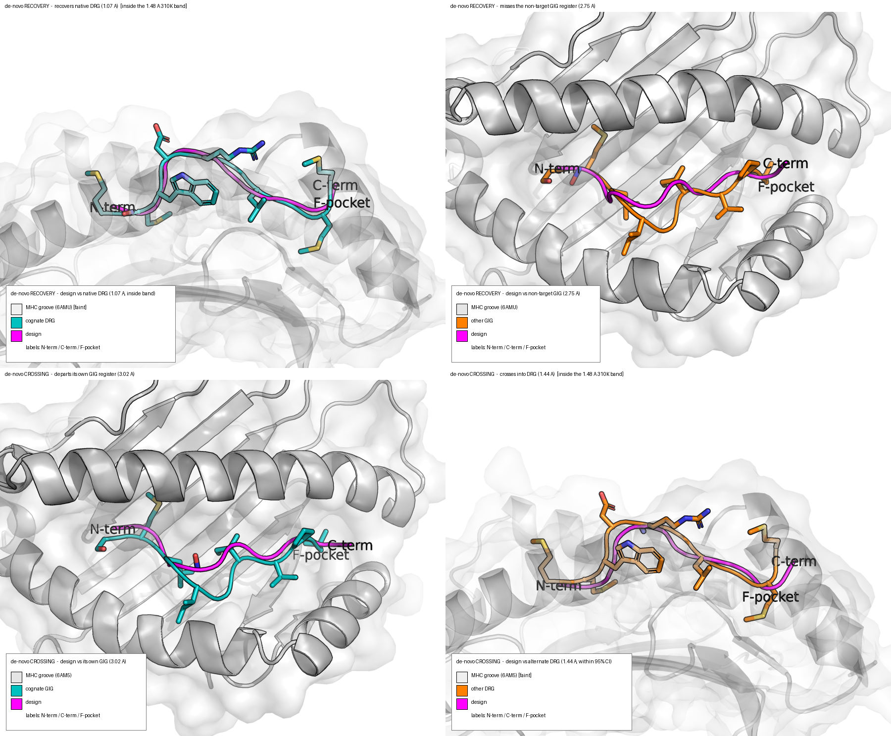

# Recovering and Redirecting Peptide Backbone Conformation via Contact-Conditioned Cα Generation in a Cross-Reactive pMHC–TCR System

Sergio E. Mares — Adimab · Center for Computational Biology, UC Berkeley

Paper: [`paper/paper.pdf`](paper/paper.pdf) · Claims: [`MAIN_CLAIMS.md`](MAIN_CLAIMS.md) · Walkthrough: [`ANALYSIS_WALKTHROUGH.md`](ANALYSIS_WALKTHROUGH.md)

---

## Abstract

Cross-reactive TCR–pMHC systems, in which one receptor engages chemically distinct peptides through
distinct bound backbone conformations, raise a question orthogonal to conventional epitope design: can a
structure-conditioned generative model be steered, from receptor-side information alone, toward a specific
target backbone conformation — including, deliberately, one other than the conformation nearest its
conditioning input? Using a minimal two-state system — the DMF5 TCR bound to HLA-A\*02:01, which
accommodates two different decameric peptides (GIG and DRG) via backbones separated by 2.87 Å Cα
RMSD — we ask whether RFdiffusion, conditioned only on receptor-side contact residues and given no
peptide-backbone template, can generate a Cα backbone that recovers a peptide's own native
conformation or crosses into the alternate one. We score de novo backbones against a three-criterion test
calibrated to native molecular-dynamics ensembles rather than to a single crystal structure, and address a
recurring evaluation pitfall by correcting for a backbone-threading artifact that raw RMSD cannot detect.
We find that both recovery and redirection are achievable but rare, gated by the breadth of conditioning
rather than by any specific curated residue set, and that once that breadth is met their frequency is
governed by sampling depth. A templating control further shows that directly supplying backbone geometry
constrains the target conformation far more tightly than contact conditioning alone, locating register in a
spatially confined signal that receptor-side contacts only weakly determine. These results, from a single
system, map the current capability boundary of contact-conditioned backbone generation and separate what
it can retrieve from what must still be supplied as explicit geometry.

## The two-state system

| register | peptide | crystal | anchors |
|---|---|---|---|
| **GIG** | `SMLGIGIVPV` | 6AM5 | P2 / PΩ=P10 |
| **DRG** | `MMWDRGLGMM` | 6AMU | P2 / PΩ=P9 |

The two native backbones differ by **2.87 Å** Cα RMSD — and that difference is almost entirely
**C-terminal**: P1–P4 are effectively identical between registers (0.30–1.14 Å), while P6 and P10 diverge
by 5.62 Å and 4.70 Å. *Which peptide position buries in the F-pocket* (p10 = GIG, p9 = DRG) is what
defines the register.

## Best recovery and best crossing candidate



**Top — the best de-novo RECOVERY.** A `max`-conditioned 6AMU design (magenta) reproduces its native
DRG backbone (teal) at **1.07 Å** Cα-RMSD, seats the correct F-pocket occupant (p9) at native burial
depth (5.81 Å) — clearing all three acceptance criteria — while clearly missing the non-native GIG
register (orange, 2.75 Å).

**Bottom — the best de-novo CROSSING.** A `L3_nterm_t2`-conditioned 6AM5 design departs from its own
GIG register (3.02 Å) and hugs the alternate DRG backbone at **1.44 Å**, seating the DRG p9 anchor — inside
the **1.48 Å** 310 K acceptance band. This is a genuine register crossing driven by receptor-side
conditioning alone.

## Results — converged campaign (24,831 designs)

Scored against the **physiological 310 K / 50 ns native MD envelope** (moving-block-bootstrap acceptance
band, DRG ≤1.48 Å, 95% CI 1.36–1.58 Å), with the full three-criterion test (Cα proximity **and** correct
F-pocket occupant **and** native burial depth):

| group | n | best → own | best → other | **recovery** | **crossing** |
|---|--:|--:|--:|--:|--:|
| **de-novo** (receptor contacts only) | 16,919 | **1.07 Å** | **1.44 Å** | **7** | **4** |
| **null** (no conditioning) | 1,533 | 2.05 Å | 2.21 Å | 0 | 0 |
| **templated** (native backbone supplied) | 6,041 | 0.10 Å | 1.28 Å | **1,282** | 1 |
| **crossover** (N-terminus supplied, C-term free) | 338 | 0.54 Å | 1.15 Å | 16 | **20** |
| **total** | **24,831** | — | — | **1,305** | **25** |

- **Recovery and crossing are real but rare.** 7 de-novo designs recover their native register (best
  1.07 Å) and 4 cross into the alternate DRG register (best 1.44 Å), every hit forward-threaded and seating
  the correct p9 anchor. All arise from the broadest conditioning schemes.
- **The no-conditioning control is clean: 0 / 1,533.** Not one unconditioned draw docks in the groove or
  comes close in RMSD to either native backbone — so the de-novo events sit above a true zero-information
  background, not sampling noise.
- **Redirection needs a register-neutral scaffold.** The purpose-built crossover experiment — templating
  the register-neutral N-terminus and leaving the divergent C-terminus free — produces **20 crossings in
  207 designs**, a ~400× enrichment over de-novo, isolating the mechanism of register redirection.
- **Templating recovers register at will** (1,282/6,041), monotonically with the number of templated
  residues — locating register in geometry that contacts only weakly determine.

> **Calibration.** All numbers use the physiological **310 K / 50 ns** native ensemble (Amber ff19SB,
> TIP3P), the study's calibration standard; thresholds carry moving-block-bootstrap 95% CIs (§2.4 of the
> paper). These README figures reflect the complete converged campaign; the paper reports the same
> three-criterion analysis on a frozen subset. See `ANALYSIS_WALKTHROUGH.md` and §2.4/§3.1/§3.6.

## Repository

| path | what |
|---|---|
| `paper/` | LaTeX source + compiled PDF. |
| `MAIN_CLAIMS.md`, `ANALYSIS_WALKTHROUGH.md` | Claim-by-claim evidence and notebook guide. |
| `notebooks/` | Analysis notebooks (MD calibration, register scoring, threading, conditioning). |
| `py/` | Scoring and analysis library — `score_denovo_designs.py` is the three-criterion register scorer; `align_full_pdb.py` produces common-frame structures for rendering. |
| `jobs/` | Savio/SLURM campaign drivers (spec generator, idempotent workers, watchdog). |
| `figures/` | Rendered figures and the PyMOL/PIL scripts that build them. |
| `inputs/focus_6am/` | 6AM5 / 6AMU / 6AMT crystals, contigs, hotspot and ladder specs. |
| `outputs/` | Not tracked (~50 GB). Curated Cα-backbone archives are published as zips: `paper_designs_by_condition.zip` and `allcond150_designs_by_condition.zip`, plus `condition_manifest.csv`. |

## Reproducing the figures

```bash
# 1. common-frame align the natives + a design (peptide -> chain P, receptor -> A/B/D/E)
python py/align_full_pdb.py inputs/focus_6am/6AMU.pdb outputs/aligned/6AMU_native_aligned.pdb
python py/align_full_pdb.py <design>.pdb              outputs/aligned/<design>_aligned.pdb

# 2. render the PyMOL views
pymol -cq figures/recovery_denovo_max/render_views.py
pymol -cq figures/crossing_L3/render_views.py

# 3. assemble Fig. 2
python figures/fig2_recovery_crossing/build_fig2.py
```

All designs are generated with RFdiffusion (`Complex_base_ckpt`, T=30, de-novo 10-mer, receptor held as
fixed context) and scored in a common groove frame defined by the 6AMU MHC α1–α2 platform.
